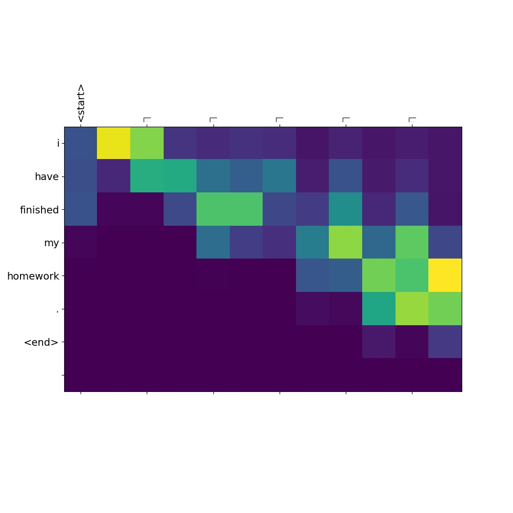

### 基于Attention机制的机器翻译

参考：

[1] neural machine translation by jointly learning to align and translate.(`https://arxiv.org/abs/1409.0473`)

[2] 具体细节参看：Tensorflow官方教程 `https://github.com/tensorflow/tensorflow/blob/r1.11/tensorflow/contrib/eager/python/examples/nmt_with_attention/nmt_with_attention.ipynb`

使用Tensorflow eager execution，代码比基于Graph和Session的tf代码要简单很多。

# 代码
中文->英文： `NMT-eager-chinese-eng.py`

西班牙与->英文： `NMT-eager.py`

# 数据
训练数据分别为： `data/eng-chinese.txt`， `data/eng-spa.txt`

# 简化
没有使用 Beam search.

# 训练
将源文件中的 `EPOCHS = 0` 改为 `EPOCHS = 10`（spa-eng）和 `EPOCHS = 50`（chinese-eng)。

中英文翻译相对于西班牙文和英文翻译来说更加困难，最终训练结果来效果一般，原因主要是训练数据是小规模的，训练的迭代次数也比较少。

这里的代码主要是为了 tensorflow eager 的演示和练习，更加权威的实现参见:
`https://github.com/tensorflow/nmt`

# Attention权重可视化
西班牙语翻译

中文翻译

（中文无法再图片中现实）
